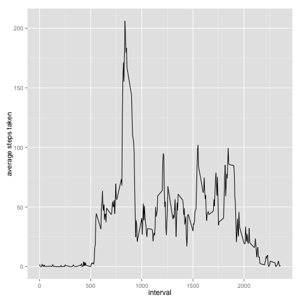
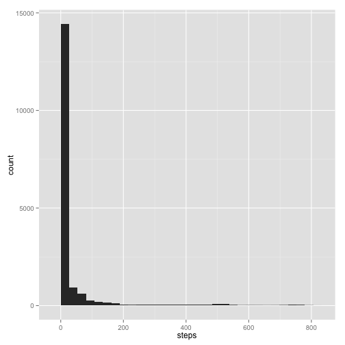

## Loading and preprocessing the data

```r
steps_data <- read.csv("activity.csv")
```


## What is the mean total number of steps taken per day?

```r
library("ggplot2")
qplot(steps, data = steps_data)
```

```
## stat_bin: binwidth defaulted to range/30. Use 'binwidth = x' to adjust this.
```

 

```r
mean_steps_per_day <- mean(steps_data$steps, na.rm=TRUE)
median <- median(steps_data$steps, na.rm=TRUE)
```
The mean total number of steps per day is: 37.38
The median total number of steps per day is: 0

## What is the average daily activity pattern?

```r
library("dplyr")
averages <- c()
intervals <- distinct(select(steps_data, interval))
for (interval in intervals$interval) {
    rows <- steps_data[steps_data$interval == interval, ]
    step_values <- select(rows, steps)
    mean_steps <- mean(step_values$steps, na.rm=TRUE)
    averages <- c(averages, mean_steps)
}
qplot(x = intervals$interval, y = averages, data = steps_data, xlab = "interval", ylab = "average steps taken", geom = "line")
```

 

```r
rounded_averages <- c()
for (average in averages) {
    rounded_avg <- round(average, digits=2)
    rounded_averages <- c(rounded_averages, rounded_avg)
}
max <- max(rounded_averages)
highest_index <- match(max, rounded_averages)
row <- steps_data[highest_index,]
interval <- row$interval
```
Interval 835 contains the highest number of steps.


## Imputing missing values

```r
values <- complete.cases(steps_data)
incomplete <- sum(values==FALSE)
mean_dates <- aggregate(steps ~ date, data=steps_data, 
                        FUN="mean")
new_steps_data <- steps_data
for (i in 1:nrow(steps_data)) {
    row <- steps_data[i,]
    if (is.na(row$steps)){
        date_of <- select(row, date)
        for (m_date in mean_dates$date) {
            new_m_date <- c(date_of)
            if (new_m_date == date_of) {
                row_num <- which(mean_dates[,1] == m_date)
                mean_num <- mean_dates[row_num, 2]
                new_steps_data[i, 1] <- mean_num
            }
        }
    }
}
qplot(steps, data = new_steps_data)
```

```
## stat_bin: binwidth defaulted to range/30. Use 'binwidth = x' to adjust this.
```

 

```r
mean_steps_per_day_new_data <- mean(new_steps_data$steps)
median_new_data <- median(new_steps_data$steps)
```
There are 2304 rows containing NA's.

After filling in missing values with the mean number of steps taken for that date:
The mean total number of steps per day is: 35.69
The median total number of steps per day is: 0


